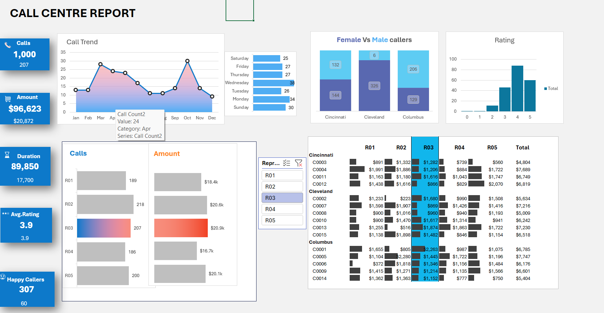

# Excel Call Centre Dashboard

## Why I did this
After building the SQL project, I wanted to practice the Excel side too — pivot tables, slicers, and dashboard design. I followed a call centre project from the Chandoo YouTube channel to learn the techniques, then built it out myself and made sure I understood how every part connects.

## The data
About 1,000 call records from 2023. Each record has: call number, customer ID, duration, representative, date of call, purchase amount, satisfaction rating, plus a few calculated fields — year, day of week, and duration bucket.

There's a second table with customer details: customer ID, gender, age, and city. This links to the calls table through customer ID, so the dashboard can break things down by things like gender and city, not just by representative.

## What's in the dashboard
- **KPI cards** — total calls, total amount, total duration, and average rating, each with a comparison figure underneath
- **Call trend chart** — calls by month across the year
- **Day-of-week breakdown** — call volume by day
- **Female vs male callers by city** — split across Cincinnati, Cleveland, and Columbus
- **Rating distribution** — how ratings spread out across the scale
- **Calls and amount by representative** — R01 through R05, with a bar chart comparing them
- **Slicer-driven customer detail table** — click a representative and the whole dashboard updates to show their calls, amounts, and customer breakdown

## Excel techniques used
- Pivot tables to summarize calls, amounts, and ratings across different dimensions (representative, gender, city, day, month)
- Slicers to connect the pivot tables so the whole dashboard filters together when you click a representative
- Calculated fields for day of week and duration bucket
- Formulas to link the calls table to the customer table via customer ID
- KPI cards and charts built from the pivot data for a clean, dashboard-style layout

## Files in the workbook
- **Customer Centre Report** — the main dashboard (KPI cards, charts, slicer)
- **Pivots** — the pivot tables behind each chart and KPI
- **Data** — the raw calls and customer data
- **Assets** — icons and images used on the dashboard (like the call icon on the KPI cards)

## What I found
This one was genuinely tough to build, and I learned a lot doing it. Getting the slicer to connect across multiple pivot tables and charts so everything updates together took real trial and error. I also learned how to work with different chart types (bar, line, pie), how to place and style shapes and icons on the dashboard, and how to line everything up so it actually looks like a dashboard instead of a pile of separate charts.

## Files in this repo
- `EXCEL project - Call Centre.xlsx` — the full interactive dashboard (open in Excel to use the slicers)
- `dashboard-overview.png` — a screenshot of the dashboard for a quick preview without downloading the file

## Preview

## Credit
Built following a call centre dashboard project from the [Chandoo](https://www.youtube.com/user/ExcelTutorials) YouTube channel. I worked through it myself, understood the logic behind the pivots and slicers, and wrote up my own notes above.

## Contact
Rachana Badri
LinkedIn: linkedin.com/in/rachana-badri
